## Astute billing administration

Browse demo dashboard: http://69.50.235.228/dashboard

Astute billing works with following entities that need to be configured:

- Billing Types
- Service Types
- Discount Types
- Discounts
- RAB Rates
- Plans
- Accounts
- Plan mappings

#### Billing Types

*Admin / Billing / Configuration / Billing Types*

Billing type determines a set of available resources and method of their cost evaluation. Astute provides support for following billing types:

- Pay As You Go *(status: implemented)*
- Resource Allocation Based *(status: implemented)*
- Resource Usage Based *(status: not implemented; in active development)*

#### Service Types

*Admin / Billing / Configuration / Service Types*

Service types are set of additional services that might be provided to end user.

#### Discount Types

*Admin / Billing / Configuration / Discount Types*

Discount types determine a set of discounts that might be applied to billing account (see below) or mapped account plan (see below). Astute supports following discount methods:

- Percentage
- Price Override

#### Discounts

*Admin / Billing / Configuration / Discounts*

Discounts define an actual discount type and amount that will be applied to end user account or mapped plans:

#### RAB Rates

*Admin / Billing / Configuration / Discounts*

RAB rates defines a resources rates for resource-allocation-based billing.

#### Plans

*Admin / Billing / Configuration / Plans*

Plan is a union of previously declared billing entities: service type, its rate and setup fee (if applicable), billing method (if applicable; additional services does not have billing method). In addition, plan consit of an instance flavor for pay as you go plans. This flavor will be used during future instance launch.

#### Accounts

*Admin / Billing / Accounts*

Account is a link between OpenStack tenant (project) and Astute billing. It defines by which billing method (type) specific tenant should be evaluated. If no billing account created for OpenStack tenant (project) then it wont be involved into billing process. This allows to have non-billable tenants (for example, for internal use and etc). Any project/tenant that need to be billed must be linked into astute system first. Additionally, per account discount might be assigned through this UI. Also, if account has RAB billing type it is possible to adjust account quotas (see table raw menu 'Modify Quotas', which is available for RAB users only).

#### Plan Mappings

*Admin / Billing / Plan Mappings*

Plan Mapping is association of defined/configured plan with billing accounts. Additonally, it might contain discount applied to this speciffic account plan mapping.

### Billing Configuration

Main tasks of billing administration are:

- Create / Modify billing plans
- Create / Modify discounts (if needed)
- Create OpenStack tenant/project (see Signups chapter below) and
- Map OpenStack tenant/project into Astute billing account
- Map (activate) plans / additional services to account
- Modify quotas for RAB accounts
- Assign discount to account or its mapped service (if needed)

#### Create / Modify billing plan

- Browse to *Admin / Billing / Configuration / Plans*

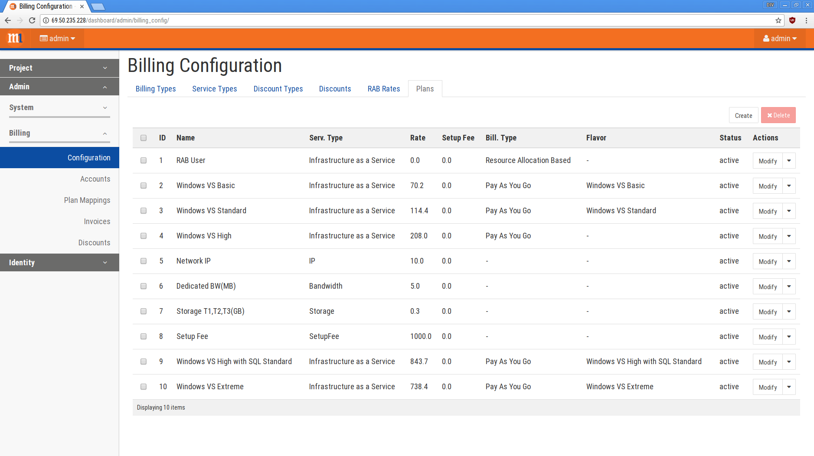

- Click *Create* button to define new billing plan or *Modify* button to modify existing plan.

- Input / Adjust plan properties

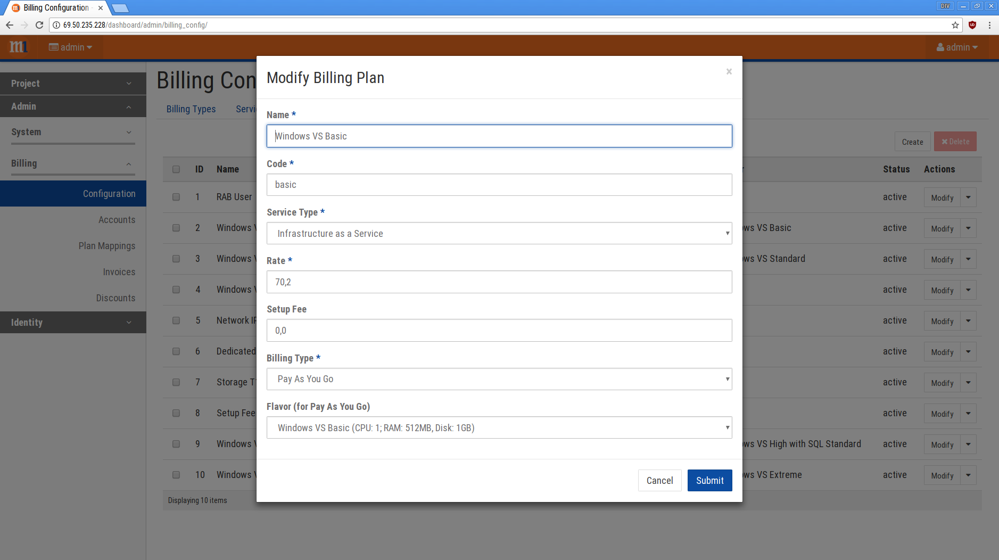

- Click *Submit* to apply changes or *Cancel* to discard

#### Create / Modify Discounts

- Browse to *Admin / Billing / Configuration / Discounts*

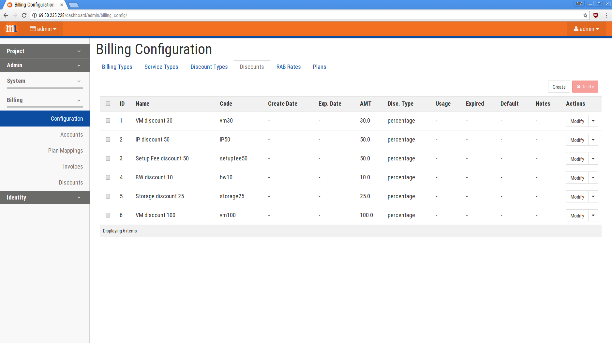

- Click *Create* button to define new discount or *Modify* button to modify existing discount.

- Input / Adjust discount properties

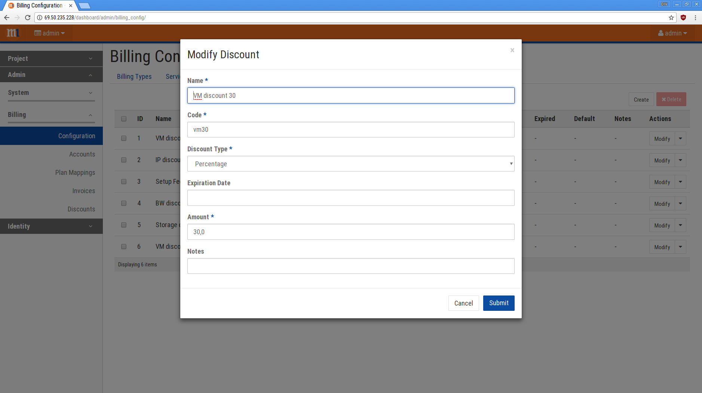

- Click *Submit* to apply changes or *Cancel* to discard

#### Create OpenStack tenant/project

This step might be implemented in 2 ways:

1. OpenStack Horizon dashboard

    - Browse to *Identity / Projects*

    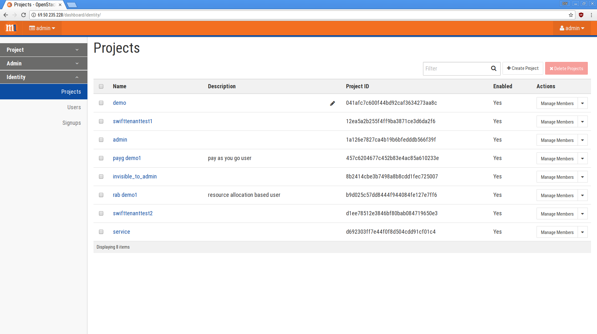

    - Click *Create* button.

    - Input / Adjust project properties

    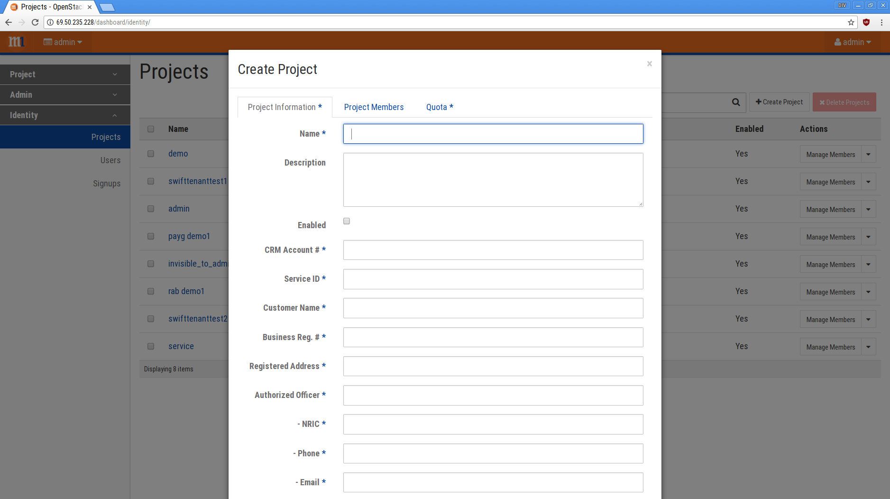

    - Submit data

2. Urbane Signup Web Application. This service described below in specific chapter.

#### Map OpenStack tenant/project into Astute billing account

- Browse to *Admin / Billing / Accounts*

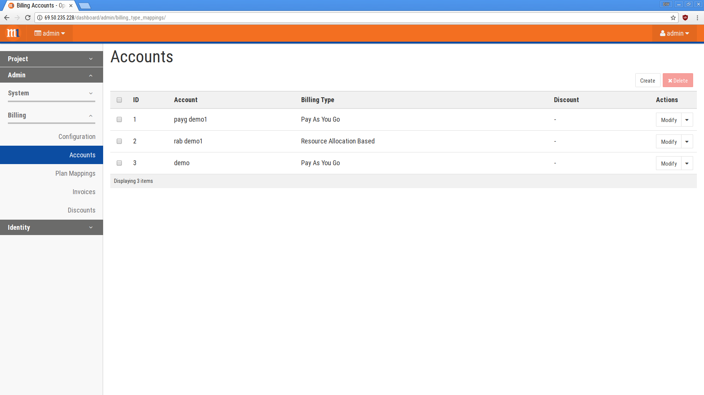

- Click *Create* button to define new account.

- Input / Adjust account properties

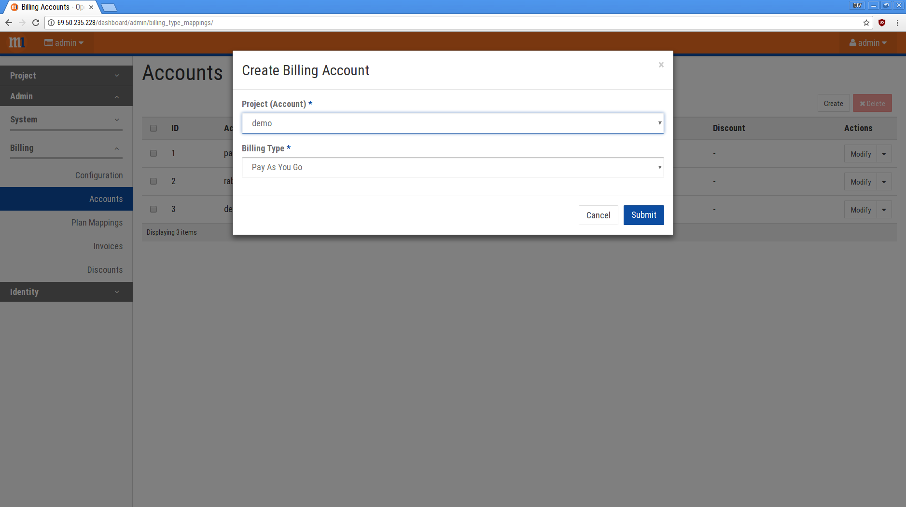

- Click *Submit* to apply changes or *Cancel* to discard

#### Map (activate) plans / additional services to account

- Browse to *Admin / Billing / Plan Mappings*

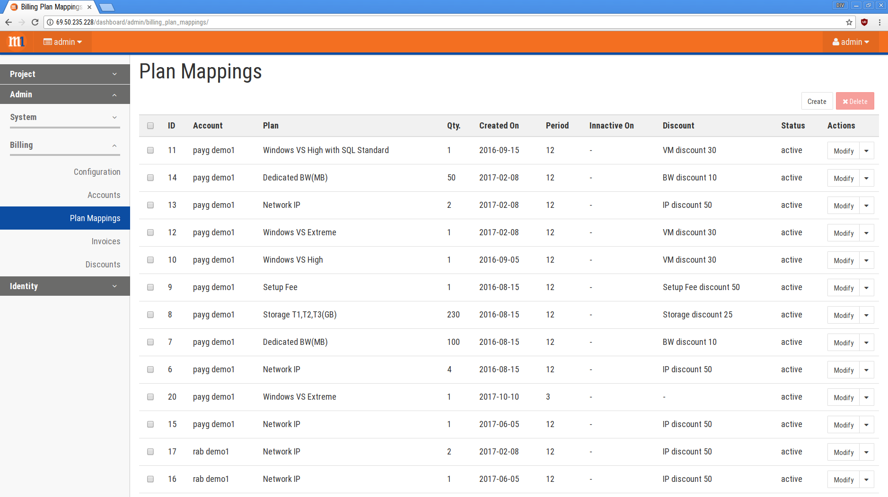

- Click *Create* button to define new plan mappings.

- Input / Adjust account properties

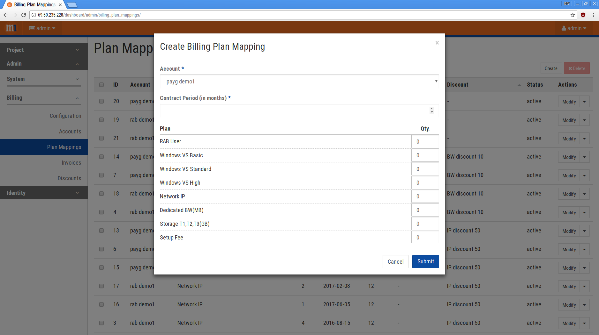

- Click *Submit* to apply changes or *Cancel* to discard

_**IMPORTANT**_: At the moment plan mapping creation dialog displays *ALL* defined plans (of type *pay as you go* and *resource allocation based*). Be careful with plans selection for account and allow only plans of same billing type. This UI part need to be re-worked for better user experience.

#### Modify quotas for RAB accounts

After billing account with billing type of *resource allocation based* has been created it is possible to adjust account quotas assigned to it:

- Browse to *Admin / Billing / Accounts*

- Click account context menu button (arrow mark in *Actions*) of RAB billing type user and select *Modify Quotas* menu item (it wont be available for accounts of different types)

- Input / Adjust account quotas

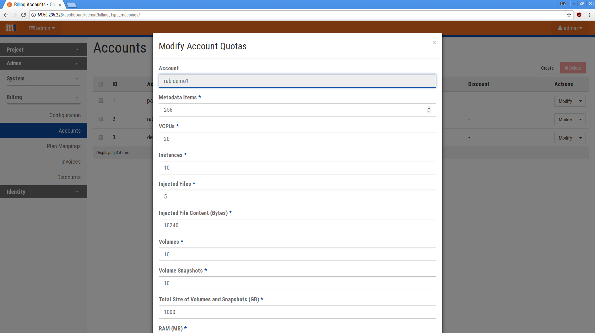

- Click *Submit* to apply changes or *Cancel* to discard

#### Assign discount to account

After billing account has been created it is possible to assign a specific discount to it:

- Browse to *Admin / Billing / Accounts*

- Click *Modify* button of required account

- Input / Adjust account discount properties

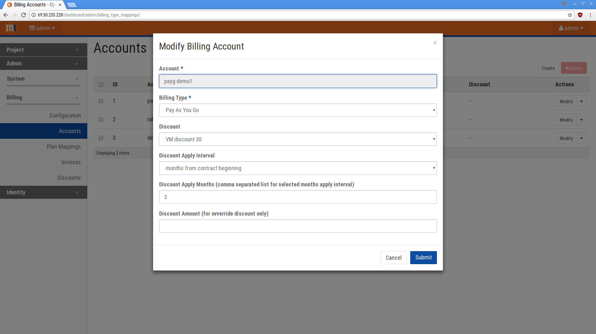

- Click *Submit* to apply changes or *Cancel* to discard

#### Assign discount to account plan mapping

After plan mapping has been created it is possible to assign a specific discount to it:

- Browse to *Admin / Billing / Plan Mappings*

- Click *Modify* button of required plan mapping

- Input / Adjust plan discount properties

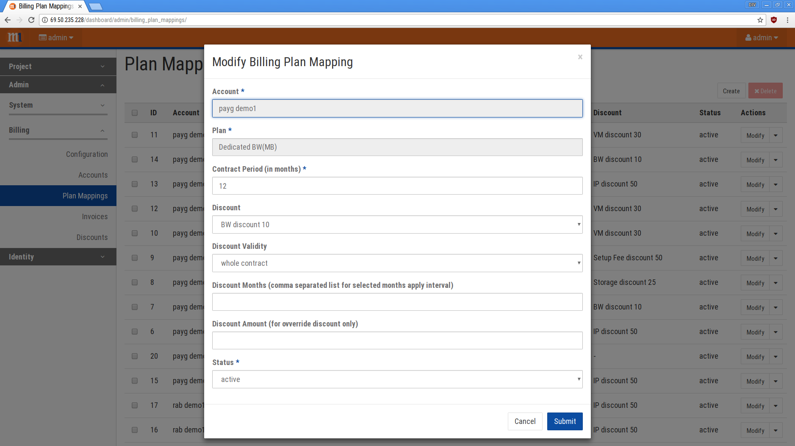

- Click *Submit* to apply changes or *Cancel* to discard

#### Browse all currently applied discounts

Browse to *Admin / Billing / Discounts*

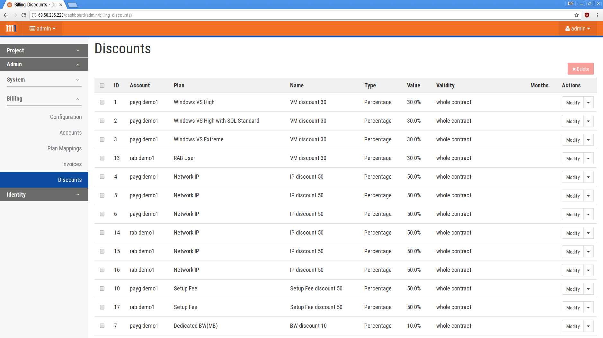

*NOTE: if no Plan value is shown in table then this discount is applied to specified account. Otherwise it is account plan discount.*

From this panel it is possible to adjust assigned discount properties as well.

### Billing Invoices

- Browse to *Admin / Billing / Invoices* to see a list of invoices:

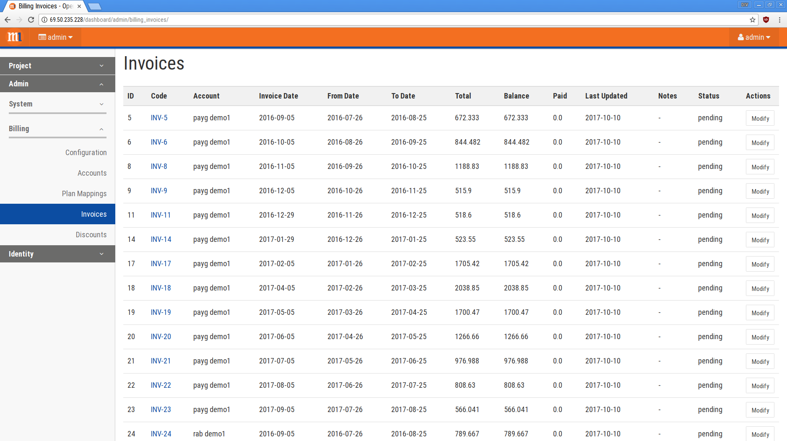

- Click on invoice code to see its details

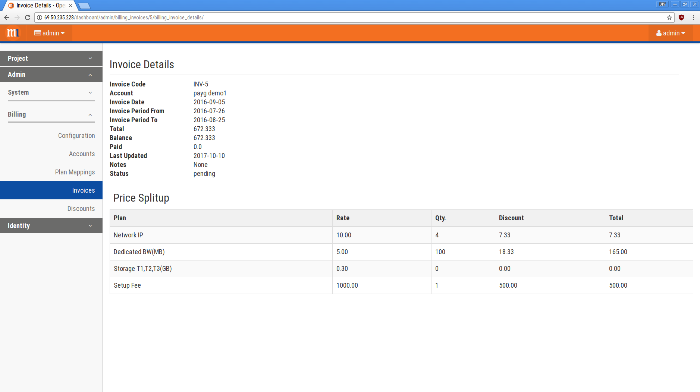

_**IMPORTANT**_ This UI panel is under active development. List of features to be implemented:

- Filtering invoices by dates and accounts
- Download invoice in PDF format
- Download invoce data from billing adapter

### Billing Adapter

Convertion of billing data from Astute billing data into M1 specified format is implemented as script. Integration of billing adapter into admin UI is in progress.

Billing adapter script creates text file with fixed format and length.

File sequence and report files will be saved into `/opt/billing/` dir.

Report period can be added by `--start` DATE `--end` DATE cmd line parameters.

If `--end` param is not specified, current date is taken (if current date > 28, then date = 28).

If `--start` param is not specified, 1 month back from `--end` is applied.

Examples:

- all active invoises in period [2017-06-25..2017-07-25]

`python billing-adapter.py --start 2017-06-25 --end 2017-07-25`

- same result - [2017-06-25..2017-07-25]

`python billing-adapter.py --end 2017-07-25`

e.g. curent date 2017-10-06, period is [2017-10-06..2017-09-06]

`python billing-adapter.py`

e.g. curent date 2017-10-30, period is [2017-10-28..2017-09-28]

`python billing-adapter.py`

## Signup Web Application

As mentioned above OpenStack tenant (project) might be created and preconfigured by Signup service (codename: Urbane). But creation of OS tenant is not the only task it resolves. After it creates OS tenant it also able to set project's default compute quotas, default block storage quotas, default network quotas and setup project internal network and router.

### Process of OpenStack tenant/project creation

- Browse demo signup: http://69.50.235.228:88/

- Enter all required data and click on *SIGNUP* button at the bottom

- In case if everything went good, success page will be displayed and new preconfigured tenant/project will appear in openstack.

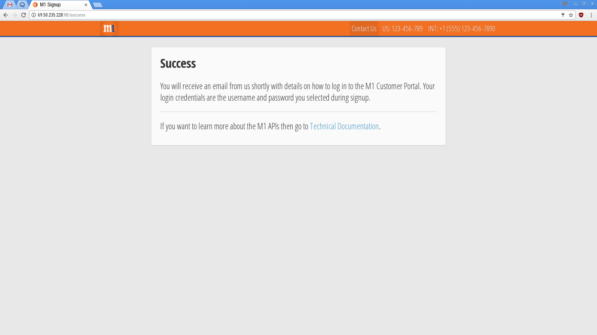

- List of exisiting signups might be explored in Horizon dashboard at *Identity / Signups*

*NOTE: Signup service is a good candidate to implement a single point of account registration: it is possible to extend this application so it will also configure Astute billing account, its billing type, assign plan mappings and discounts.*

## Customer Billing Interface

_**IMPORTANT**_*: This part of user interface is in active development.*

After OpenStack tenant/project has been mapped into Astute billing, customer gets few billing related pannels in its portal:

- List of account invoices:

  Browse *Project / Billing / Invoices*

  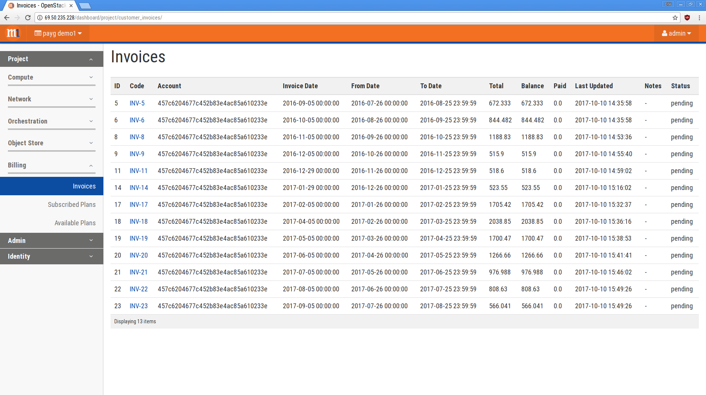

- List of subscribed (assigned) plans:

  Browse *Project / Billing / Subscribed Plans*

  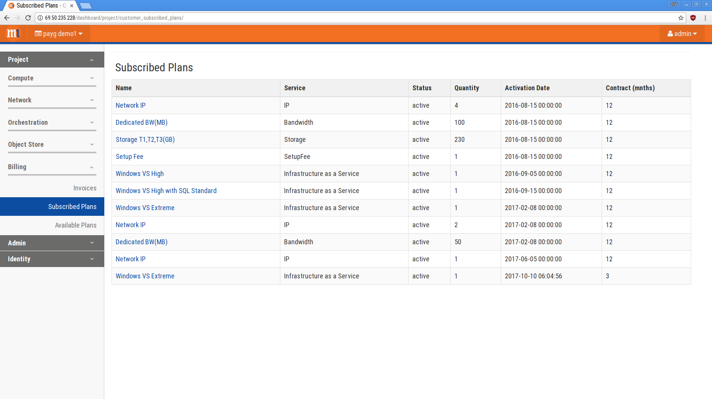

- List of available plans:

  Browse *Project / Billing / Available Plans*

  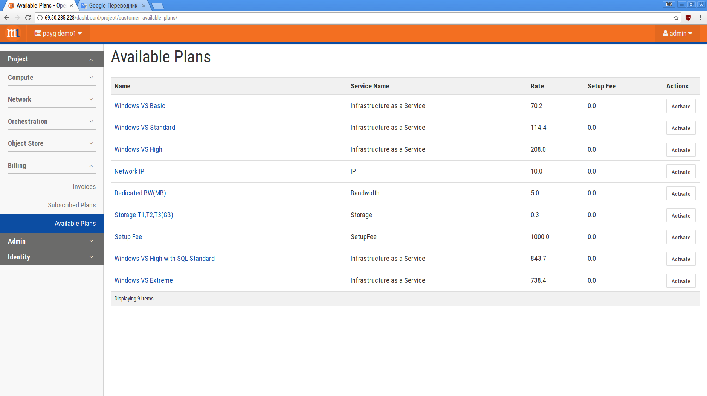

  From this interface customer could activate (subscribe) additional plans.
